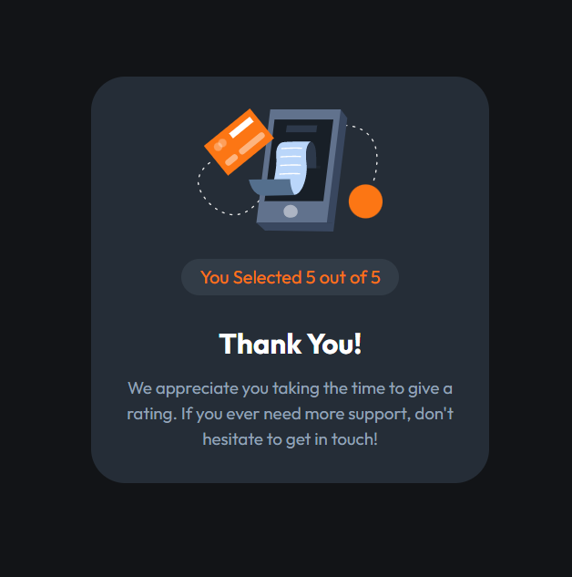
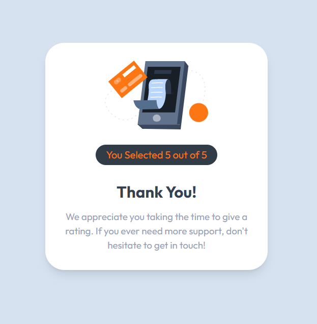

# React Tailwind Rating Component

This rating component is an interactive way for users to rate their experience with a product or service. It is built with React and Tailwind CSS, and is highly customizable to fit your project's needs. It includes both a dark mode and light mode.

## Discover it

You can see a demo of the component at [ratecompo.netlify.app](https://ratecompo.netlify.app/).

## Dark Mode

### Rating Interface

### Result Interface

## Light Mode

### Rating Interface

### Result Interface

